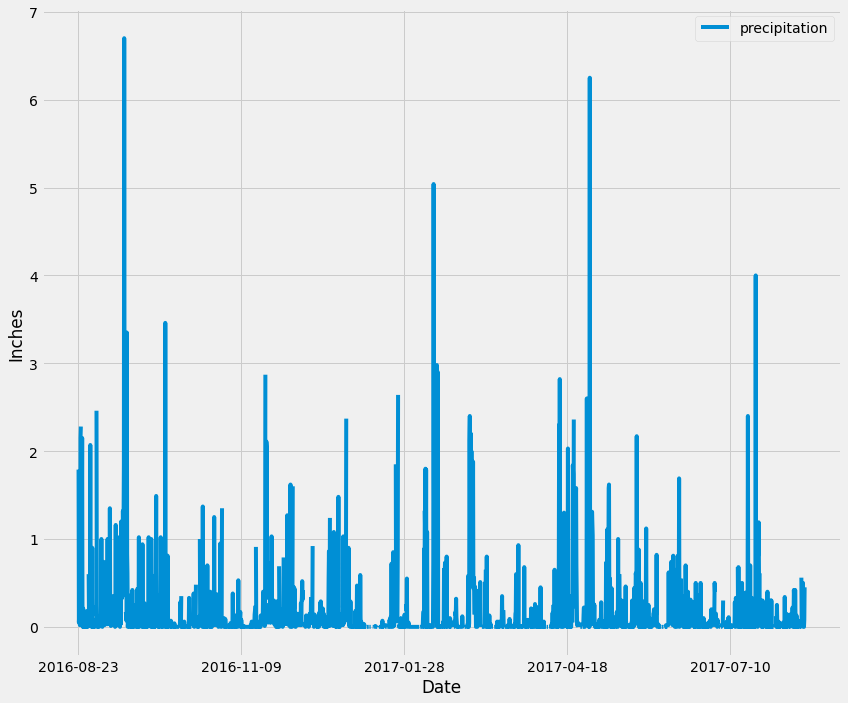

# sqlalchemy-challenge: Surf's Up
In preparation for a Hawaii vacation, climate data from Jan. 2010 to Aug. 2017 was analyzed. The [climate.ipynb](climate.ipynb) encompasses Part 1. [app.py](app.py) contains the application created in Part 2. Bonus 1 and Bonus 2 are located in [temp_analysis_bonus1.ipynb](temp_analysis_bonus1.ipynb) and [temp_analysis_bonus2.ipynb](temp_analysis_bonus2.ipynb), respectively.

## Part 1: Climate Analysis and Exploration
Using modlues `SQLAlchemy`, `Pandas`, and  `Matplotlib`, the [hawaii sqlite file](Resources/hawaii.sqlite) was explored. Before the data could be accessed, the subsequent steps were followed:

1. Connect to the SQLite database using SQLAlchemy's `create_engine`.
2. Reflect the tables into classes using SQLAlchemy's `automap_base`.
   
    a. Save reference to the classes Station and Measurement.
3. Link Python to the database using SQLAlchemy's `Session`.

### Precipitation Analysis
Using the most recent date in the Measurement dataset, the previous 12 months of precipitation data was queried. The queried precipitation data, and their corresponding dates, were transformed into a Panda's dataframe with the date column as the index. Once sorted by date, the dataframe was visualized as a bar graph.

### Station Analysis
After calculating the number of stations in the Station dataset, a query of the most active station (the station with the highest number of observations) was created. The lowest, highest, and average temperatures were calculated referencing the ID of the most active station.

Another search was queried, retrieving the temperature observation data (TOBS) from the last 12 months, again focusing on the most active station. The TOBS data was then plotted as a histogram.

## Part 2: Designing a Climate App
A Flask API was created based on Part 1 with the following routes:
- `/` 
    - The homepage.
    - A list of all available routes.
- `/api/v1.0/precipitation`
    - Queries precipitation data from the previous 12 months. 
    - A JSON list of precipitation data and their corresponding dates.
- `/api/v1.0/stations`
    - A JSON list of all stations.
- `/api/v1.0/tobs`
    - Queries temperature observations from the previous 12 months for the most active station.
    - A JSON list of TOBS and corresponding dates.
- `/api/v1.0/start/<start>`
    - Queries the minimum, average, and maximum temperatures given a start date.
    - A JSON list of temperature metrics calculated from a given start date.
- `/api/v1.0/start/<start>/end/<end>`
    - Queries the minimum, average, and maximum temperatures given a start and end date (inclusive).
    - A JSON list of temperature metrics calculated from a given start and end date.

## Bonus 1: Temperature Analysis I
Using the [hawaii measurements CSV](Resources/hawaii_measurements.csv), the following question was addressed: **Is there a meaningful difference between the temperatures in June and December?**

To answer the question, the CSV file was converted into a Pandas dataframe, with the date column (in datetime format) as the index. With the months June and December isolated, their average temperatures were calculated. An unpaired t-test was run with all June and December data because two different subjects (months) were being compared. The test produced a statistic of $\approx 31.36$ and $p \approx 4.19*10^{-187}$, suggesting that there is a relatively large, statistically significant, difference between June and December temperatures. 

## Bonus 2: Temperature Analysis II
With the tentative vacation dates May 23 to May 28 in mind, historical data was parsed. 

Using matching dates from the previous year, the minimum, average, and maximum temperatures were determined. This data was plotted as a bar graph, with the average temperature as the bar and peak-to-peak (maximum to minimum) as the error bar. 

### Daily Average Rainfall
Using matching dates from the previous year, total rainfall was calculated for each station. The query returned the station, name, latitude, longitude, elevation, and total rainfall during the time period, descending by precipitation amount. 

### Daily Temperature Normals
After converting the start and end dates of the trip into a range of dates in Month-Day format, the minimum, average, and maximum temperatures were calculated for each day in the range over all years in the dataset. Once the query results were put into a Pandas dataframe, with date as the index, the results were visualized via an unstacked area plot. 

